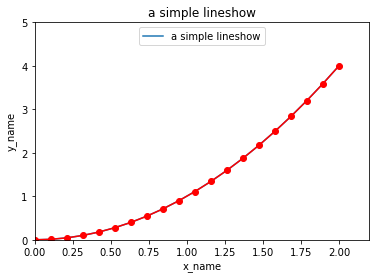
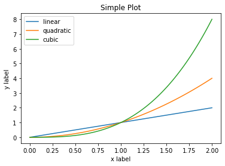
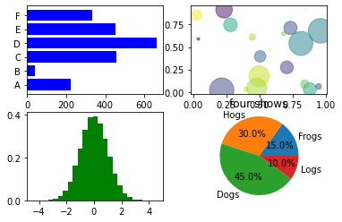
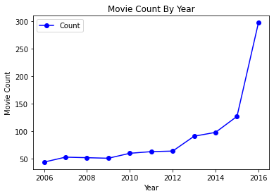
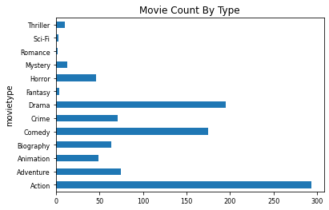
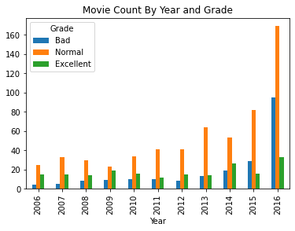
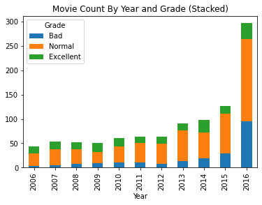
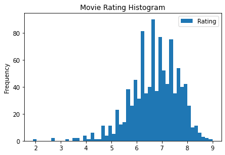

## 使用matplotlib.pyplot画图


```python
import matplotlib.pyplot as plt 
import numpy as np
x = np.linspace(0, 2, 20) 
y = x ** 2
plt.plot(x, y) ## 折线图
plt.plot(x, y,'ro-') ## 折线图 'ro-'表示{颜色为r,形状为o,线条为-},等同于{color=o,marker=o,linestyle='-'}
plt.title('a simple lineshow') ## 添加图表名称
plt.xlabel('x_name') ## 添加X轴名称
plt.ylabel('y_name') ## 添加y轴名称
plt.xlim(0, 2.2) ##设置X轴区间
plt.ylim(0, 5) ##设置y轴区间
plt.legend(['a simple lineshow'], loc = 'upper center') ## 设置图例名称，位置上居中
plt.show() ## 展示图表
```





```python
## 可以在一个图形中同时画多条曲线图，多次调用 plot ( ) 函数即可
import matplotlib.pyplot as plt 
import numpy as np
x = np.linspace(0, 2, 100) 
plt.plot(x, x)
plt.plot(x, x ** 2)
plt.plot(x, x ** 3)
plt.xlabel('x label')
plt.ylabel('y label')
plt.title("Simple Plot-2") 
plt.legend(['linear', 'quadratic', 'cubic'])  ## 添加3个线条的图例,list传入
plt.show()
```





```python
## ，需要在一个图形中同时画多个不同类型的子图
import matplotlib.pyplot as plt 
import numpy as np
plt.subplot(2, 2, 1)  ##表示在2行2列的图，第一个位置展示图
# plt.subplot (nrows, ncols, index) 函数用来在一个图形中绘制多个子图，需要传入 3 个参
# 数，第一个nrows表示行数，第二个ncols表示列数，第三个index是从1到nrows * ncols 的值，表示在子图中的第几个位置。
# 整个绘图区域被分为 nrows 行和 ncols 列，其中子图排 列的顺序是从第 1 行开始，从左到右依次排开，到达行尾后换到下一行，行尾取决于列数。
x = [ 'A', 'B', 'C', 'D', 'E', 'F']
y = [222, 42, 455, 664, 454, 334] 
plt.barh(x, y, height=0.8, color='b') ## plt.barch() 表示横向的柱状图,height表示的是柱子的宽度(默认0.8,感觉0.8很好看)，

## 在第二个位置画图
plt.subplot(2, 2, 2)
x = np.random.rand(20)
y = np.random.rand(20)
colors = np.random.rand(20)
area = (30 * np.random.rand(20)) ** 2 
plt.scatter(x, y, s=area, c=colors, alpha=0.5) ## 散点图，s参数表示点的大小，c表示colors，alpha表示颜色透明度

## 在第三个位置画图
plt.subplot(2, 2, 3)
data = np.random.randn(100000)
plt.hist(data, bins=25, density=True, facecolor='g', alpha=1) ## 柱状图，density表示累积分布图，bins表示均分25个柱子,alpha表示颜色透明度

## 在第四个位置画图
plt.subplot(2, 2, 4)
labels = 'Frogs', 'Hogs', 'Dogs', 'Logs'
data = [ 15, 30, 45, 10 ]
plt.pie(data, labels=labels, autopct='%1.1f%%') 
##plt.pie饼状图，labels设置标签，autopct='%1.1f%%' 表示以保留 1 位小数的百分比形式显示各个部分的占比
plt.axis('equal') ## 表示x轴和y轴具有相同的刻度，保障了饼图是圆的

plt.show()


```





## pandas自带画图


```python
## 使用pandas自带的方法画图
import matplotlib.pyplot as plt 
import pandas as pd
movie_pd = pd.read_csv('/Users/beanscc/Desktop/python个人文件/总结/data_source/IMDB-Movie-Data.csv',header=0) ## 读取数据，第一行为表头
movie_count = movie_pd.groupby('Year').size().reset_index(name = 'Count')  
## 计算每年的数量，并重新组合数据,reset_index达到的目的，原有的Series转换为DataFrame类型，且columns的name为count
movie_count.plot(x = 'Year', y = 'Count', color = 'b', marker = 'o', legend = True) ##pandas自带的plot
plt.title('Movie Count By Year') 
plt.xlabel('Year') 
plt.ylabel('Movie Count') 
plt.show()
```





```python
movie_pd.head()
```


<div>
<style scoped>
    .dataframe tbody tr th:only-of-type {
        vertical-align: middle;
    }

    .dataframe tbody tr th {
        vertical-align: top;
    }

    .dataframe thead th {
        text-align: right;
    }
</style>
<table border="1" class="dataframe">
  <thead>
    <tr style="text-align: right;">
      <th></th>
      <th>Rank</th>
      <th>Title</th>
      <th>Genre</th>
      <th>Description</th>
      <th>Director</th>
      <th>Actors</th>
      <th>Year</th>
      <th>Runtime (Minutes)</th>
      <th>Rating</th>
      <th>Votes</th>
      <th>Revenue (Millions)</th>
      <th>Metascore</th>
    </tr>
  </thead>
  <tbody>
    <tr>
      <th>0</th>
      <td>1</td>
      <td>Guardians of the Galaxy</td>
      <td>Action,Adventure,Sci-Fi</td>
      <td>A group of intergalactic criminals are forced ...</td>
      <td>James Gunn</td>
      <td>Chris Pratt, Vin Diesel, Bradley Cooper, Zoe S...</td>
      <td>2014</td>
      <td>121</td>
      <td>8.1</td>
      <td>757074</td>
      <td>333.13</td>
      <td>76.0</td>
    </tr>
    <tr>
      <th>1</th>
      <td>2</td>
      <td>Prometheus</td>
      <td>Adventure,Mystery,Sci-Fi</td>
      <td>Following clues to the origin of mankind, a te...</td>
      <td>Ridley Scott</td>
      <td>Noomi Rapace, Logan Marshall-Green, Michael Fa...</td>
      <td>2012</td>
      <td>124</td>
      <td>7.0</td>
      <td>485820</td>
      <td>126.46</td>
      <td>65.0</td>
    </tr>
    <tr>
      <th>2</th>
      <td>3</td>
      <td>Split</td>
      <td>Horror,Thriller</td>
      <td>Three girls are kidnapped by a man with a diag...</td>
      <td>M. Night Shyamalan</td>
      <td>James McAvoy, Anya Taylor-Joy, Haley Lu Richar...</td>
      <td>2016</td>
      <td>117</td>
      <td>7.3</td>
      <td>157606</td>
      <td>138.12</td>
      <td>62.0</td>
    </tr>
    <tr>
      <th>3</th>
      <td>4</td>
      <td>Sing</td>
      <td>Animation,Comedy,Family</td>
      <td>In a city of humanoid animals, a hustling thea...</td>
      <td>Christophe Lourdelet</td>
      <td>Matthew McConaughey,Reese Witherspoon, Seth Ma...</td>
      <td>2016</td>
      <td>108</td>
      <td>7.2</td>
      <td>60545</td>
      <td>270.32</td>
      <td>59.0</td>
    </tr>
    <tr>
      <th>4</th>
      <td>5</td>
      <td>Suicide Squad</td>
      <td>Action,Adventure,Fantasy</td>
      <td>A secret government agency recruits some of th...</td>
      <td>David Ayer</td>
      <td>Will Smith, Jared Leto, Margot Robbie, Viola D...</td>
      <td>2016</td>
      <td>123</td>
      <td>6.2</td>
      <td>393727</td>
      <td>325.02</td>
      <td>40.0</td>
    </tr>
  </tbody>
</table>
</div>


```python
movie_pd.groupby('Year').size()
```


    Year
    2006     44
    2007     53
    2008     52
    2009     51
    2010     60
    2011     63
    2012     64
    2013     91
    2014     98
    2015    127
    2016    297
    dtype: int64


```python
movie_pd.groupby('Year').size().reset_index(name='Count')
```


<div>
<style scoped>
    .dataframe tbody tr th:only-of-type {
        vertical-align: middle;
    }

    .dataframe tbody tr th {
        vertical-align: top;
    }

    .dataframe thead th {
        text-align: right;
    }
</style>
<table border="1" class="dataframe">
  <thead>
    <tr style="text-align: right;">
      <th></th>
      <th>Year</th>
      <th>Count</th>
    </tr>
  </thead>
  <tbody>
    <tr>
      <th>0</th>
      <td>2006</td>
      <td>44</td>
    </tr>
    <tr>
      <th>1</th>
      <td>2007</td>
      <td>53</td>
    </tr>
    <tr>
      <th>2</th>
      <td>2008</td>
      <td>52</td>
    </tr>
    <tr>
      <th>3</th>
      <td>2009</td>
      <td>51</td>
    </tr>
    <tr>
      <th>4</th>
      <td>2010</td>
      <td>60</td>
    </tr>
    <tr>
      <th>5</th>
      <td>2011</td>
      <td>63</td>
    </tr>
    <tr>
      <th>6</th>
      <td>2012</td>
      <td>64</td>
    </tr>
    <tr>
      <th>7</th>
      <td>2013</td>
      <td>91</td>
    </tr>
    <tr>
      <th>8</th>
      <td>2014</td>
      <td>98</td>
    </tr>
    <tr>
      <th>9</th>
      <td>2015</td>
      <td>127</td>
    </tr>
    <tr>
      <th>10</th>
      <td>2016</td>
      <td>297</td>
    </tr>
  </tbody>
</table>
</div>


```python
##柱状图，各类型电影分布
movie_pd['Movie_Type'] = movie_pd['Genre'].map(lambda x : x.split(',')[0]) 
## Genre为电影的标签，一个电影可以有多个标签，该方法是截取第一个作为电影的白哦钱
movie_type = movie_pd.groupby('Movie_Type').size().reset_index(name = 'Count') 
## 各类型计数
movie_type.plot(kind = 'barh', x = 'Movie_Type', legend = False) ## barh，横柱状图
plt.title('Movie Count By Type')
plt.ylabel('movietype')
plt.tick_params(labelsize = 8) ##表示设置坐标轴标签的字体大小为 9
plt.show()
```





```python
###不同等级电影分布
movie_pd['Grade'] = pd.cut(movie_pd['Rating'], bins = [0, 6, 7.5, 10], labels=['Bad', 'Normal', 'Excellent']) 
##区间划分，0～6为Bad，6～7.5位Normal，7.5～10为Excellent
group_pd = movie_pd.groupby(['Year', 'Grade']).size().unstack() ##下拉看效果
group_pd[['Bad', 'Normal', 'Excellent']].plot(kind = 'bar') #等同于group_pd[].plot(kind = 'bar')
plt.title('Movie Count By Year and Grade') 
plt.show()
```





```python
##unstack前的效果
test=movie_pd.groupby(['Year', 'Grade']).size()
test
```


    Year  Grade    
    2006  Bad            4
          Normal        25
          Excellent     15
    2007  Bad            5
          Normal        33
          Excellent     15
    2008  Bad            8
          Normal        30
          Excellent     14
    2009  Bad            9
          Normal        23
          Excellent     19
    2010  Bad           10
          Normal        34
          Excellent     16
    2011  Bad           10
          Normal        41
          Excellent     12
    2012  Bad            8
          Normal        41
          Excellent     15
    2013  Bad           13
          Normal        64
          Excellent     14
    2014  Bad           19
          Normal        53
          Excellent     26
    2015  Bad           29
          Normal        82
          Excellent     16
    2016  Bad           95
          Normal       169
          Excellent     33
    dtype: int64


```python
##unstack后的效果
group_pd = movie_pd.groupby(['Year', 'Grade']).size().unstack()
group_pd

```


<div>
<style scoped>
    .dataframe tbody tr th:only-of-type {
        vertical-align: middle;
    }

    .dataframe tbody tr th {
        vertical-align: top;
    }

    .dataframe thead th {
        text-align: right;
    }
</style>
<table border="1" class="dataframe">
  <thead>
    <tr style="text-align: right;">
      <th>Grade</th>
      <th>Bad</th>
      <th>Normal</th>
      <th>Excellent</th>
    </tr>
    <tr>
      <th>Year</th>
      <th></th>
      <th></th>
      <th></th>
    </tr>
  </thead>
  <tbody>
    <tr>
      <th>2006</th>
      <td>4</td>
      <td>25</td>
      <td>15</td>
    </tr>
    <tr>
      <th>2007</th>
      <td>5</td>
      <td>33</td>
      <td>15</td>
    </tr>
    <tr>
      <th>2008</th>
      <td>8</td>
      <td>30</td>
      <td>14</td>
    </tr>
    <tr>
      <th>2009</th>
      <td>9</td>
      <td>23</td>
      <td>19</td>
    </tr>
    <tr>
      <th>2010</th>
      <td>10</td>
      <td>34</td>
      <td>16</td>
    </tr>
    <tr>
      <th>2011</th>
      <td>10</td>
      <td>41</td>
      <td>12</td>
    </tr>
    <tr>
      <th>2012</th>
      <td>8</td>
      <td>41</td>
      <td>15</td>
    </tr>
    <tr>
      <th>2013</th>
      <td>13</td>
      <td>64</td>
      <td>14</td>
    </tr>
    <tr>
      <th>2014</th>
      <td>19</td>
      <td>53</td>
      <td>26</td>
    </tr>
    <tr>
      <th>2015</th>
      <td>29</td>
      <td>82</td>
      <td>16</td>
    </tr>
    <tr>
      <th>2016</th>
      <td>95</td>
      <td>169</td>
      <td>33</td>
    </tr>
  </tbody>
</table>
</div>


```python
## 累积柱状图
group_pd[['Bad', 'Normal', 'Excellent']].plot(kind = 'bar', stacked = True)  ##stacked=True达到了累积柱状图的效果
plt.title('Movie Count By Year and Grade (Stacked)')
plt.show()
```





```python
##直方图
movie_pd[['Rating']].plot(kind = 'hist', bins = 50) 
plt.title('Movie Rating Histogram')
plt.show()
```





```python

```
